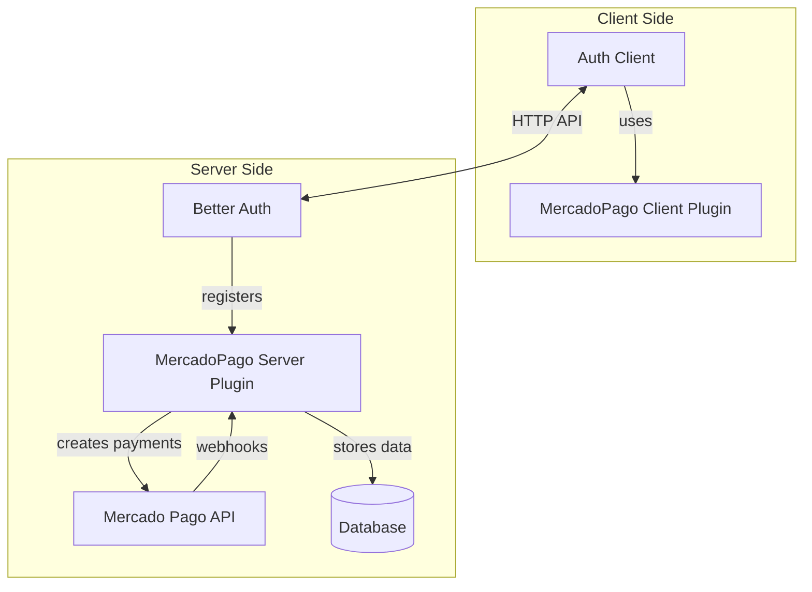
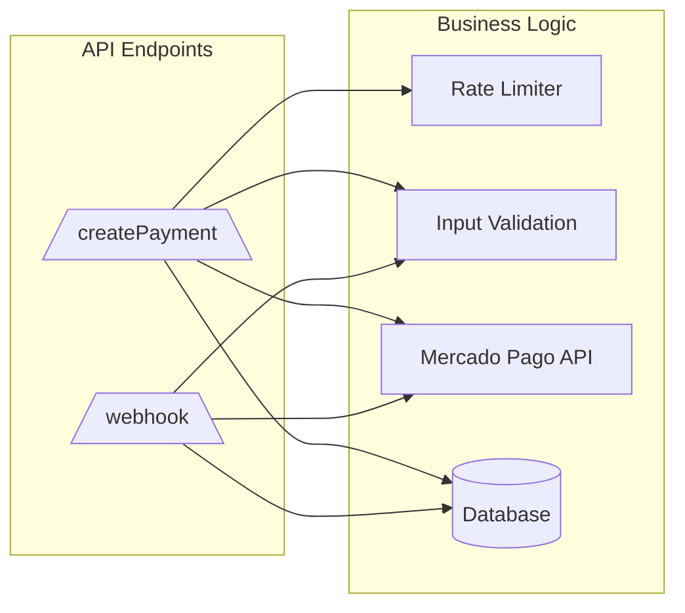
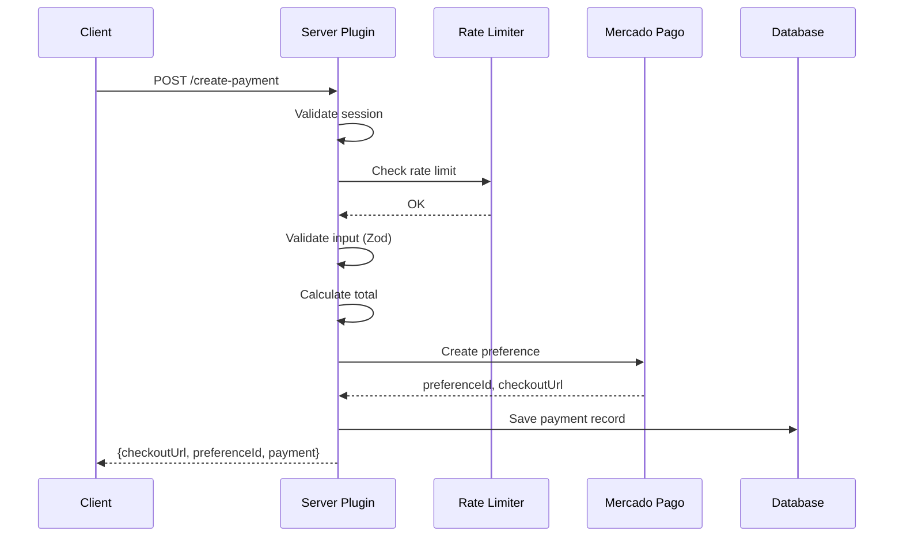
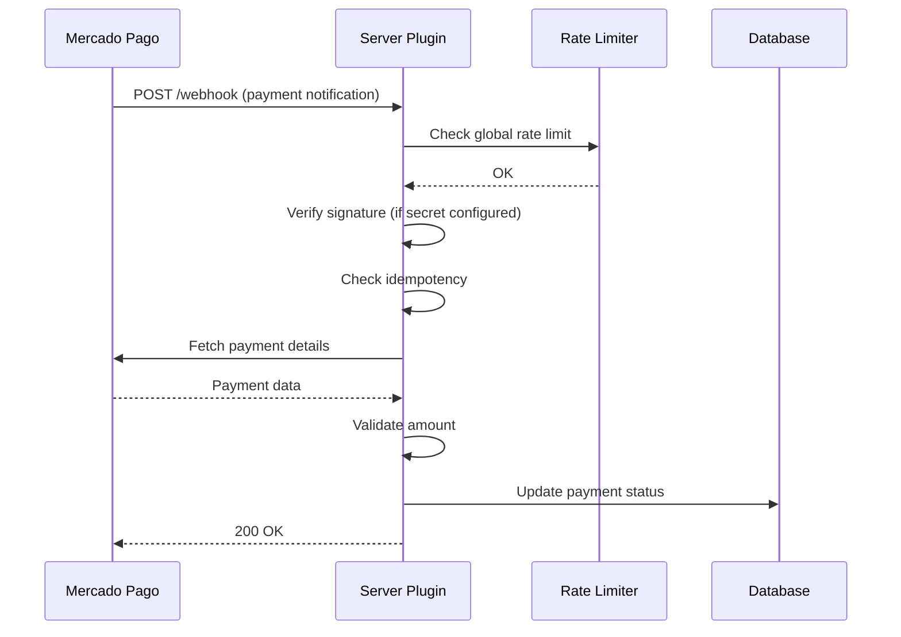

# Architecture Documentation

This document describes the internal architecture of `better-auth-mercadopago` for contributors and advanced users who want to understand how the plugin works.

## Table of Contents

- [Overview](#overview)
- [Plugin Structure](#plugin-structure)
- [Client-Side Architecture](#client-side-architecture)
- [Server-Side Architecture](#server-side-architecture)
- [Database Schema](#database-schema)
- [Security Considerations](#security-considerations)
- [Webhook Processing](#webhook-processing)
- [Extending the Plugin](#extending-the-plugin)

## Overview

The plugin follows Better Auth's plugin architecture, consisting of two main parts:

1. **Client Plugin** (`mercadoPagoClientPlugin`) - Exposes type-safe methods to the frontend
2. **Server Plugin** (`mercadoPagoPlugin`) - Handles API endpoints, webhooks, and database operations



## Plugin Structure

```
src/
├── index.ts      # Main exports
├── client.ts     # Client plugin definition
├── server.ts     # Server plugin with endpoints
├── types.ts      # TypeScript interfaces
├── schemas.ts    # Zod validation schemas
└── security.ts   # Security utilities
```

### File Responsibilities

| File | Purpose |
|------|---------|
| `index.ts` | Entry point, exports both client and server plugins |
| `client.ts` | Defines the client-side plugin structure for Better Auth |
| `server.ts` | Contains all server endpoints, webhook handlers, and business logic |
| `types.ts` | All TypeScript interfaces and type definitions |
| `schemas.ts` | Zod schemas for request validation |
| `security.ts` | Rate limiting, signature verification, sanitization |

## Client-Side Architecture

The client plugin is minimal because Better Auth's client automatically infers server endpoints:

```typescript
// src/client.ts
export const mercadoPagoClientPlugin = () => {
  return {
    id: "mercadopago",
    $InferServerPlugin: {} as ReturnType<typeof mercadoPagoPlugin>,
  } satisfies BetterAuthClientPlugin;
};
```

### How Client Methods Work

When you call `authClient.mercadoPago.createPayment()`, Better Auth:

1. Looks up the endpoint registered by the server plugin
2. Makes an HTTP POST to `/api/auth/mercado-pago/create-payment`
3. Returns the typed response

The client doesn't contain business logic - it's just a type-safe proxy to server endpoints.

## Server-Side Architecture

The server plugin is where all the logic resides:



### Endpoint Registration

The plugin registers two main endpoints:

1. **`/mercado-pago/create-payment`** - Creates payment preferences
2. **`/mercado-pago/webhook`** - Receives webhook notifications

### createPayment Flow



### Webhook Flow



## Database Schema

The plugin defines one main table through Better Auth's schema system:

### mercadoPagoPayment

| Field | Type | Required | Description |
|-------|------|----------|-------------|
| `id` | string | Yes | Internal UUID |
| `externalReference` | string | Yes | Unique reference for MP |
| `userId` | string | Yes | Link to auth user |
| `mercadoPagoPaymentId` | string | No | MP's payment ID |
| `preferenceId` | string | Yes | MP's preference ID |
| `status` | string | Yes | pending, approved, rejected, etc. |
| `statusDetail` | string | No | Detailed status |
| `amount` | number | Yes | Payment amount |
| `currency` | string | Yes | Currency code (ARS, USD, etc.) |
| `paymentMethodId` | string | No | visa, master, pix, etc. |
| `paymentTypeId` | string | No | credit_card, debit_card, etc. |
| `metadata` | string | No | JSON stringified metadata |
| `createdAt` | date | Yes | Creation timestamp |
| `updatedAt` | date | Yes | Last update timestamp |

### Schema Generation

Better Auth CLI generates the appropriate database schema based on this definition. Run:

```bash
pnpm dlx @better-auth/cli@latest generate
```

This creates migrations for your database adapter (Prisma, Drizzle, etc.).

## Security Considerations

### Rate Limiting

The plugin implements rate limiting in `src/security.ts`:

```typescript
// Payment creation: 10 requests per minute per user
const rateLimitKey = `payment:create:${session.user.id}`;
rateLimiter.check(rateLimitKey, 10, 60 * 1000);

// Webhooks: 1000 requests per minute globally
const webhookRateLimitKey = "webhook:global";
rateLimiter.check(webhookRateLimitKey, 1000, 60 * 1000);
```

**Note:** The default implementation uses in-memory storage. For production, replace with Redis.

### Webhook Signature Verification

Mercado Pago signs webhooks with HMAC SHA256. The plugin verifies:

```typescript
const manifest = `id:${dataId};request-id:${xRequestId};ts:${ts};`;
const hmac = crypto.createHmac("sha256", secret);
hmac.update(manifest);
const expectedHash = hmac.digest("hex");
```

See [`verifyWebhookSignature`](src/security.ts:9) for implementation.

### Amount Validation

To prevent payment tampering, the plugin validates amounts:

```typescript
function validatePaymentAmount(
  requestedAmount: number,
  mpPaymentAmount: number,
  tolerance: number = 0.01
): boolean {
  const diff = Math.abs(requestedAmount - mpPaymentAmount);
  return diff <= tolerance;
}
```

### Metadata Sanitization

User-provided metadata is sanitized to prevent:

- Prototype pollution (`__proto__`, `constructor`)
- Excessive size (strings truncated to 5000 chars)
- Nested object injection

See [`sanitizeMetadata`](src/security.ts:99) for implementation.

### Idempotency

Payment creation supports idempotency keys to prevent duplicate charges:

```typescript
const cachedResult = idempotencyStore.get(idempotencyKey);
if (cachedResult) {
  return ctx.json(cachedResult); // Return cached result
}
```

## Webhook Processing

### Webhook Types

Currently supported webhook types:

| Type | Description | Handler |
|------|-------------|---------|
| `payment` | Payment status updates | Automatic processing |

### Webhook Payload Structure

```typescript
interface MercadoPagoPaymentNotification {
  action: "payment.created";
  api_version: "v1";
  data: {
    id: string; // payment id
  };
  date_created: string;
  id: number; // notification id
  live_mode: boolean;
  type: "payment";
  user_id: string;
}
```

### Idempotency in Webhooks

Webhooks are deduplicated using a composite key:

```typescript
const webhookId = `mp:webhook:${notification.type}:${notification.data.id}`;
if (idempotencyStore.get(webhookId)) {
  return ctx.json({ received: true }); // Already processed
}
```

### Error Handling

Webhooks always return 200 OK to Mercado Pago, even on errors:

```typescript
try {
  // Process webhook
} catch (error) {
  logger.error("Error processing MP webhook", { error });
  return ctx.json({ received: true }); // MP expects 200
}
```

This prevents Mercado Pago from retrying failed webhooks indefinitely.

## Extending the Plugin

### Adding New Endpoints

To add a new endpoint, extend the `endpoints` object in `src/server.ts`:

```typescript
endpoints: {
  // ... existing endpoints
  
  myNewEndpoint: createAuthEndpoint(
    "/mercado-pago/my-endpoint",
    {
      method: "POST",
      requireAuth: true,
      body: MySchema,
    },
    async (ctx) => {
      // Your logic here
      return ctx.json({ success: true });
    }
  ),
}
```

### Adding Database Tables

Extend the `schema` object in the plugin:

```typescript
schema: {
  // ... existing tables
  
  myNewTable: {
    fields: {
      id: { type: "string", required: true },
      // ... more fields
    },
  },
}
```

Run `pnpm dlx @better-auth/cli@latest generate` to update database schema.

### Custom Callbacks

The plugin supports lifecycle callbacks:

```typescript
mercadoPagoPlugin({
  onPaymentUpdate: async ({ payment, status, mpPayment }) => {
    // Custom logic when payment updates
  },
  onSubscriptionUpdate: async ({ subscription, status, reason }) => {
    // Custom logic when subscription updates
  },
  onSubscriptionPayment: async ({ subscription, payment }) => {
    // Custom logic on recurring payments
  },
});
```

### Replacing Rate Limiter

To use Redis instead of in-memory storage:

```typescript
// src/security.ts
export class RateLimiter {
  constructor(private redis: RedisClient) {}
  
  async check(key: string, maxAttempts: number, windowMs: number): Promise<boolean> {
    const current = await this.redis.incr(key);
    if (current === 1) {
      await this.redis.pexpire(key, windowMs);
    }
    return current <= maxAttempts;
  }
}
```

## Type Safety

The plugin maintains type safety through:

1. **Zod schemas** for runtime validation
2. **TypeScript interfaces** for compile-time checking
3. **Better Auth's inference** for client-side types

### Type Flow

```
Zod Schema (runtime) → TypeScript Interface (compile-time) → Better Auth Client (inferred)
```

Example:

```typescript
// Schema (src/schemas.ts)
export const MercadoPagoPreferenceSchema = z.object({
  items: z.array(z.any()).min(1),
  // ...
});

// Type (src/types.ts)
export interface CreatePaymentParams {
  items: PaymentItem[];
  // ...
}

// Usage - fully typed
const { data } = await authClient.mercadoPago.createPayment({
  items: [{ id: "1", title: "Test", quantity: 1, unitPrice: 10 }],
});
// data is typed as CreatePaymentResponse
```

## Future Architecture

Planned architectural improvements:

1. **Plugin composition** - Split into sub-plugins (payments, subscriptions, marketplace)
2. **Event system** - Replace callbacks with event emitter pattern
3. **Plugin options validation** - Zod schema for plugin configuration
4. **Database adapters** - Support for more than just Prisma via Better Auth

This document describes the internal architecture of `better-auth-mercadopago` for contributors and advanced users who want to understand how the plugin works.

## Table of Contents

- [Overview](#overview)
- [Plugin Structure](#plugin-structure)
- [Client-Side Architecture](#client-side-architecture)
- [Server-Side Architecture](#server-side-architecture)
- [Database Schema](#database-schema)
- [Security Considerations](#security-considerations)
- [Webhook Processing](#webhook-processing)
- [Extending the Plugin](#extending-the-plugin)

## Overview

The plugin follows Better Auth's plugin architecture, consisting of two main parts:

1. **Client Plugin** (`mercadoPagoClientPlugin`) - Exposes type-safe methods to the frontend
2. **Server Plugin** (`mercadoPagoPlugin`) - Handles API endpoints, webhooks, and database operations


## Plugin Structure

```
src/
├── index.ts      # Main exports
├── client.ts     # Client plugin definition
├── server.ts     # Server plugin with endpoints
├── types.ts      # TypeScript interfaces
├── schemas.ts    # Zod validation schemas
└── security.ts   # Security utilities
```

### File Responsibilities

| File | Purpose |
|------|---------|
| `index.ts` | Entry point, exports both client and server plugins |
| `client.ts` | Defines the client-side plugin structure for Better Auth |
| `server.ts` | Contains all server endpoints, webhook handlers, and business logic |
| `types.ts` | All TypeScript interfaces and type definitions |
| `schemas.ts` | Zod schemas for request validation |
| `security.ts` | Rate limiting, signature verification, sanitization |

## Client-Side Architecture

The client plugin is minimal because Better Auth's client automatically infers server endpoints:

```typescript
// src/client.ts
export const mercadoPagoClientPlugin = () => {
  return {
    id: "mercadopago",
    $InferServerPlugin: {} as ReturnType<typeof mercadoPagoPlugin>,
  } satisfies BetterAuthClientPlugin;
};
```

### How Client Methods Work

When you call `authClient.mercadoPago.createPayment()`, Better Auth:

1. Looks up the endpoint registered by the server plugin
2. Makes an HTTP POST to `/api/auth/mercado-pago/create-payment`
3. Returns the typed response

The client doesn't contain business logic - it's just a type-safe proxy to server endpoints.

## Server-Side Architecture

The server plugin is where all the logic resides:


### Endpoint Registration

The plugin registers two main endpoints:

1. **`/mercado-pago/create-payment`** - Creates payment preferences
2. **`/mercado-pago/webhook`** - Receives webhook notifications

### createPayment Flow


### Webhook Flow


## Database Schema

The plugin defines one main table through Better Auth's schema system:

### mercadoPagoPayment

| Field | Type | Required | Description |
|-------|------|----------|-------------|
| `id` | string | Yes | Internal UUID |
| `externalReference` | string | Yes | Unique reference for MP |
| `userId` | string | Yes | Link to auth user |
| `mercadoPagoPaymentId` | string | No | MP's payment ID |
| `preferenceId` | string | Yes | MP's preference ID |
| `status` | string | Yes | pending, approved, rejected, etc. |
| `statusDetail` | string | No | Detailed status |
| `amount` | number | Yes | Payment amount |
| `currency` | string | Yes | Currency code (ARS, USD, etc.) |
| `paymentMethodId` | string | No | visa, master, pix, etc. |
| `paymentTypeId` | string | No | credit_card, debit_card, etc. |
| `metadata` | string | No | JSON stringified metadata |
| `createdAt` | date | Yes | Creation timestamp |
| `updatedAt` | date | Yes | Last update timestamp |

### Schema Generation

Better Auth CLI generates the appropriate database schema based on this definition. Run:

```bash
pnpm dlx @better-auth/cli@latest generate
```

This creates migrations for your database adapter (Prisma, Drizzle, etc.).

## Security Considerations

### Rate Limiting

The plugin implements rate limiting in `src/security.ts`:

```typescript
// Payment creation: 10 requests per minute per user
const rateLimitKey = `payment:create:${session.user.id}`;
rateLimiter.check(rateLimitKey, 10, 60 * 1000);

// Webhooks: 1000 requests per minute globally
const webhookRateLimitKey = "webhook:global";
rateLimiter.check(webhookRateLimitKey, 1000, 60 * 1000);
```

**Note:** The default implementation uses in-memory storage. For production, replace with Redis.

### Webhook Signature Verification

Mercado Pago signs webhooks with HMAC SHA256. The plugin verifies:

```typescript
const manifest = `id:${dataId};request-id:${xRequestId};ts:${ts};`;
const hmac = crypto.createHmac("sha256", secret);
hmac.update(manifest);
const expectedHash = hmac.digest("hex");
```

See [`verifyWebhookSignature`](src/security.ts:9) for implementation.

### Amount Validation

To prevent payment tampering, the plugin validates amounts:

```typescript
function validatePaymentAmount(
  requestedAmount: number,
  mpPaymentAmount: number,
  tolerance: number = 0.01
): boolean {
  const diff = Math.abs(requestedAmount - mpPaymentAmount);
  return diff <= tolerance;
}
```

### Metadata Sanitization

User-provided metadata is sanitized to prevent:

- Prototype pollution (`__proto__`, `constructor`)
- Excessive size (strings truncated to 5000 chars)
- Nested object injection

See [`sanitizeMetadata`](src/security.ts:99) for implementation.

### Idempotency

Payment creation supports idempotency keys to prevent duplicate charges:

```typescript
const cachedResult = idempotencyStore.get(idempotencyKey);
if (cachedResult) {
  return ctx.json(cachedResult); // Return cached result
}
```

## Webhook Processing

### Webhook Types

Currently supported webhook types:

| Type | Description | Handler |
|------|-------------|---------|
| `payment` | Payment status updates | Automatic processing |

### Webhook Payload Structure

```typescript
interface MercadoPagoPaymentNotification {
  action: "payment.created";
  api_version: "v1";
  data: {
    id: string; // payment id
  };
  date_created: string;
  id: number; // notification id
  live_mode: boolean;
  type: "payment";
  user_id: string;
}
```

### Idempotency in Webhooks

Webhooks are deduplicated using a composite key:

```typescript
const webhookId = `mp:webhook:${notification.type}:${notification.data.id}`;
if (idempotencyStore.get(webhookId)) {
  return ctx.json({ received: true }); // Already processed
}
```

### Error Handling

Webhooks always return 200 OK to Mercado Pago, even on errors:

```typescript
try {
  // Process webhook
} catch (error) {
  logger.error("Error processing MP webhook", { error });
  return ctx.json({ received: true }); // MP expects 200
}
```

This prevents Mercado Pago from retrying failed webhooks indefinitely.

## Extending the Plugin

### Adding New Endpoints

To add a new endpoint, extend the `endpoints` object in `src/server.ts`:

```typescript
endpoints: {
  // ... existing endpoints
  
  myNewEndpoint: createAuthEndpoint(
    "/mercado-pago/my-endpoint",
    {
      method: "POST",
      requireAuth: true,
      body: MySchema,
    },
    async (ctx) => {
      // Your logic here
      return ctx.json({ success: true });
    }
  ),
}
```

### Adding Database Tables

Extend the `schema` object in the plugin:

```typescript
schema: {
  // ... existing tables
  
  myNewTable: {
    fields: {
      id: { type: "string", required: true },
      // ... more fields
    },
  },
}
```

Run `pnpm dlx @better-auth/cli@latest generate` to update database schema.

### Custom Callbacks

The plugin supports lifecycle callbacks:

```typescript
mercadoPagoPlugin({
  onPaymentUpdate: async ({ payment, status, mpPayment }) => {
    // Custom logic when payment updates
  },
  onSubscriptionUpdate: async ({ subscription, status, reason }) => {
    // Custom logic when subscription updates
  },
  onSubscriptionPayment: async ({ subscription, payment }) => {
    // Custom logic on recurring payments
  },
});
```

### Replacing Rate Limiter

To use Redis instead of in-memory storage:

```typescript
// src/security.ts
export class RateLimiter {
  constructor(private redis: RedisClient) {}
  
  async check(key: string, maxAttempts: number, windowMs: number): Promise<boolean> {
    const current = await this.redis.incr(key);
    if (current === 1) {
      await this.redis.pexpire(key, windowMs);
    }
    return current <= maxAttempts;
  }
}
```

## Type Safety

The plugin maintains type safety through:

1. **Zod schemas** for runtime validation
2. **TypeScript interfaces** for compile-time checking
3. **Better Auth's inference** for client-side types

### Type Flow

```
Zod Schema (runtime) → TypeScript Interface (compile-time) → Better Auth Client (inferred)
```

Example:

```typescript
// Schema (src/schemas.ts)
export const MercadoPagoPreferenceSchema = z.object({
  items: z.array(z.any()).min(1),
  // ...
});

// Type (src/types.ts)
export interface CreatePaymentParams {
  items: PaymentItem[];
  // ...
}

// Usage - fully typed
const { data } = await authClient.mercadoPago.createPayment({
  items: [{ id: "1", title: "Test", quantity: 1, unitPrice: 10 }],
});
// data is typed as CreatePaymentResponse
```

## Future Architecture

Planned architectural improvements:

1. **Plugin composition** - Split into sub-plugins (payments, subscriptions, marketplace)
2. **Event system** - Replace callbacks with event emitter pattern
3. **Plugin options validation** - Zod schema for plugin configuration
4. **Database adapters** - Support for more than just Prisma via Better Auth

